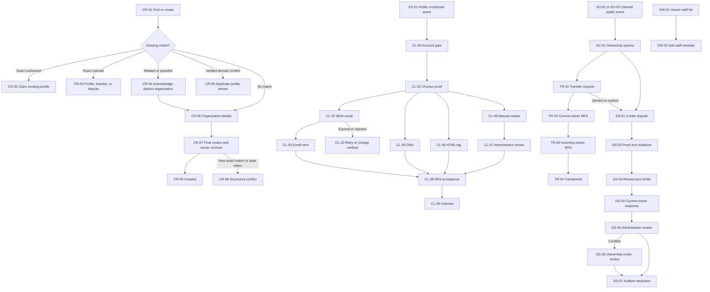

# Affiliate organization ownership mockups

Open `index.html` in a browser. The artifact contains a clickable flow chart, a searchable screen index, desktop and mobile preview controls, the proposed dispute decision, and the post-build edge-case audit.

The prototype is local and read-only. It does not call BracketIQ APIs or change database state.

## Flow inventory

## Screen counts

| Flow | IDs | Screens |
| --- | --- | ---: |
| Public event | `EV-01`–`EV-05` | 5 |
| Organization creation | `CR-01`–`CR-09` | 9 |
| Initial claim | `CL-00`–`CL-10` | 11 |
| Claimed-profile ownership, owner staffing, and transfer | `AC-01`, `OW-01`–`OW-02`, `TR-01`–`TR-04` | 7 |
| Ownership dispute | `DS-01`–`DS-07` | 7 |
| Total |  | 39 |

## Dispute decision

A user does not “re-claim” a claimed organization. They create a structured ownership issue from one of three contexts:

1. “Report an ownership issue” on a claimed profile.
2. An exact claimed-profile result in the organization-creation wizard.
3. A denied or expired ownership-transfer request.

The requester selects an issue reason and requested ownership outcome, verifies their connection, supplies bounded public evidence, reviews the linked history, and certifies that the report is accurate. A complete, non-abusive request notifies the current owner and gives them a bounded response period. Filing alone does not alter ownership, access, public badges, or ranking. An administrator must first mark the dispute credible before the public profile changes to “Ownership under review.”

Resolution is not limited to transferring ownership. The administrator may uphold the current owner, initiate an MFA-protected transfer, revoke the claim to unclaimed, suspend access for credible fraud, or merge/correct duplicate profiles. Every resolution is audited and sent to both parties.

Staff access is deliberately outside the public claim and dispute system. Organization owners and authorized managers add known users from the Staff page, choose a role, review its permissions, and send the invitation. Public visitors cannot send unsolicited staff-access requests.

## Render audit

Validated on 2026-07-29 with a real Chromium browser:

- All 39 screen IDs render.
- All internal screen transitions resolve to an existing state.
- No screen contains `undefined` or `[object Object]`.
- No screen has horizontal overflow at the desktop preview width.
- No screen has horizontal overflow at the 390px mobile preview width.
- The public event keeps the organizer-site action visually primary.
- Filing a dispute does not immediately display the disputed public state; `DS-06` is reserved for an administrator credibility decision.

The prototype tracks 29 named edge cases in the “Post-build audit” section of `index.html`.
